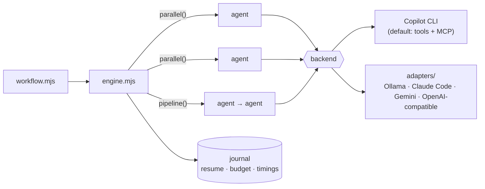

<div align="center">


**One JavaScript file describes the work. The engine fans out subagents,
enforces JSON Schema on their answers, and resumes interrupted runs.**

<p>
  
  
  
  
  
</p>

`agent()` · `parallel()` · `pipeline()` · schema-enforced output · resume from journal · token budgets

</div>

---

Claude Code ships a Workflow engine like this built in. Everything else does
not. This repo gives the same orchestration to every other model and agent
CLI: GitHub Copilot CLI out of the box, and anything you can reach from a
shell — opencode, Gemini CLI, Ollama, llama.cpp, vLLM, Kimi, GLM, DeepSeek,
OpenRouter. Open-source models on your own machine are a first-class backend.



## See it run

```console
$ node engine.mjs run examples/max-probe.mjs
── Phase: Fanout ──
  ▶ #0 fan:alfa    ▶ #1 fan:beta    ▶ #2 fan:gamma
  ▶ #3 fan:delta   ▶ #4 fan:epsilon ▶ #5 fan:zeta
  ✔ #4 fan:epsilon (0.0k tok)
  ▶ #6 fan:eta
  ✔ #2 fan:gamma (0.0k tok)
  ▶ #7 fan:theta
  ...
• fanout: 8/8 correct

── Phase: Schema ──
  ✔ #14 schema-review (0.3k tok)
• schema: 3 bugs, validated

done — 18 live agents, 0 cached, ~1.4k tokens
```

Eight agents race against a concurrency cap of six; the journal records
tokens, queue time, and duration per agent. `engine.mjs watch <runId>` shows
the same tree live for a running workflow.

## A workflow

```js
export const meta = {
  name: 'review-changes',
  description: 'Review changed files, verify each finding',
  phases: [{ title: 'Review' }, { title: 'Verify' }],
}

phase('Review')
const findings = await parallel(DIMENSIONS.map(d => () =>
  agent(d.prompt, { schema: FINDINGS_SCHEMA })))

phase('Verify')
const verified = await pipeline(
  findings.filter(Boolean).flatMap(f => f.findings),
  f => agent(`Try to refute: ${f.title}`, { schema: VERDICT_SCHEMA }),
)
return { verified }
```

## Install

```bash
git clone https://github.com/marcelsafin/fanout ~/.copilot/skills/workflows
cd ~/.copilot/skills/workflows
node engine.mjs doctor    # one cheap agent, verifies the wiring
node engine.mjs run examples/ping.mjs
```

Copilot CLI picks the skill up from `~/.copilot/skills/` on its own. The
engine also runs standalone from any directory; Node 18 or newer is the only
requirement.

## Backends

| Backend | Setup | Subagent tools | Real token counts |
|---------|-------|:--:|:--:|
| **Copilot CLI** (default) | none | ✅ bash, files, MCP, StructuredOutput | ✅ |
| **Copilot CLI + local model** | 3 env vars ([BYOK](#local-models)) | ✅ | ✅ |
| **Claude Code** | `WORKFLOW_AGENT_CMD=adapters/claude-code.sh` | ✅ Claude Code's tools | estimate |
| **opencode** | `WORKFLOW_AGENT_CMD=adapters/opencode.sh` | ✅ opencode's tools | estimate |
| **Gemini CLI** | `WORKFLOW_AGENT_CMD=adapters/gemini.sh` | ✅ Gemini's tools | estimate |
| **Ollama** | `WORKFLOW_AGENT_CMD=adapters/ollama.sh` | text only | estimate |
| **Any OpenAI-compatible endpoint** — local (llama.cpp, vLLM, LM Studio) or hosted (Kimi, GLM, DeepSeek, OpenRouter) | `WORKFLOW_AGENT_CMD=adapters/openai-compatible.sh` | text only | estimate |
| **Anything else** | any executable: prompt in `$1`, reply on stdout | up to you | estimate |

Orchestration, schema retry, resume, and budgets behave the same on every
backend. Each adapter is a few lines of bash in [`adapters/`](adapters/);
copy one to wire up whatever you run.

```bash
# open-source model, fully offline:
WORKFLOW_OLLAMA_MODEL=llama3.1:8b \
WORKFLOW_AGENT_CMD=adapters/ollama.sh \
node engine.mjs run my-workflow.mjs
```

### Local models

<a name="local-models"></a>Copilot CLI accepts OpenAI-compatible providers, so
subagents keep their tools, MCP servers, and the StructuredOutput tool while
inference runs on your machine:

```bash
export COPILOT_PROVIDER_BASE_URL=http://localhost:11434/v1
export COPILOT_PROVIDER_TYPE=openai
export COPILOT_MODEL=qwen2.5-coder:14b
node engine.mjs run my-workflow.mjs
```

Tool calling needs a model trained for it; Qwen 2.5 Coder and Llama 3.1+
handle it, small 3B models miss often. The text fallback catches the misses.

## Script API

| Call | Does |
|------|------|
| `agent(prompt, opts?)` | Spawn one subagent. Returns its reply text, or a schema-validated object with `opts.schema`. Terminal failure returns `null`, never throws. |
| `parallel(thunks)` | Run tasks concurrently, wait for all. A failed thunk resolves to `null`. |
| `pipeline(items, ...stages)` | Push each item through the stages with no barrier between stages. Stage callbacks get `(prev, item, index)`. |
| `phase(title)` / `log(msg)` | Group progress output; print a status line. |
| `budget` | `{ total, spent(), remaining() }`. A hard ceiling: past the total, `agent()` throws. |
| `workflow(ref, args)` | Run another workflow inline, one nesting level, shared budget. |
| `args` | Whatever you passed with `--args`, verbatim. |

`agent()` options: `label`, `phase`, `schema`, `model`, `effort`,
`agentType`, `isolation: 'worktree'` (a fresh git worktree, removed when the
agent leaves no changes, kept when it commits or leaves dirty files).

Scripts stay deterministic so resume works: `Date.now()`, `Math.random()`,
and argument-less `new Date()` throw inside a script.

## Commands

```bash
engine.mjs run <script.mjs> [--args <json>] [--budget <n>] [--resume <runId>] [--bg]
engine.mjs watch <runId>     # live phase-grouped progress tree
engine.mjs list              # all runs with status
engine.mjs journal <runId>   # per-agent results, tokens, timings
engine.mjs doctor            # backend self-test with raw output
```

`--resume` replays completed agents from the journal: identical
`(prompt, opts)` calls return cached results, edited calls run live.
`--bg` detaches the run, logs to the run directory, and posts a macOS
notification when it finishes.

## Structured output

With `opts.schema` on the Copilot backend, the engine starts a per-agent MCP
server whose single tool, `StructuredOutput`, carries your schema as its
input schema. The model submits its answer as a tool call and the engine
validates the arguments. On every backend, plain-text JSON works as the
fallback path: validation errors go back to the model for a retry. The
validator rejects schema keywords it cannot enforce instead of ignoring them.

## Environment

| Variable | Effect |
|----------|--------|
| `WORKFLOW_AGENT_CMD` | Replace the backend with any command. |
| `WORKFLOW_AGENT_ARGS` | Extra flags for every `copilot` invocation. |
| `WORKFLOW_AGENT_TIMEOUT_MS` | Per-agent hard timeout, default 240000. The whole process group dies on expiry. |
| `WORKFLOW_OUTPUT_FORMAT` | `json` (default) or `text`. |

Known Copilot CLI issue: an MCP server that connects after the prompt was
sent (slow starters) makes `copilot -p` append an empty user turn, and the
model then answers the empty turn. `doctor` detects the pattern. Until the
fix lands upstream, disable the slow server for workflow runs:
`WORKFLOW_AGENT_ARGS="--disable-mcp-server <name>"`.

## Tests

```bash
bash test/run-tests.sh
```

Nineteen checks against a stub backend: no network, no model calls, under a
minute. They cover pipeline semantics, schema retry, resume caching, budget
ceilings, worktree isolation, SIGINT recovery, and the JSONL token parser
against a captured-format fixture.

## License

MIT
